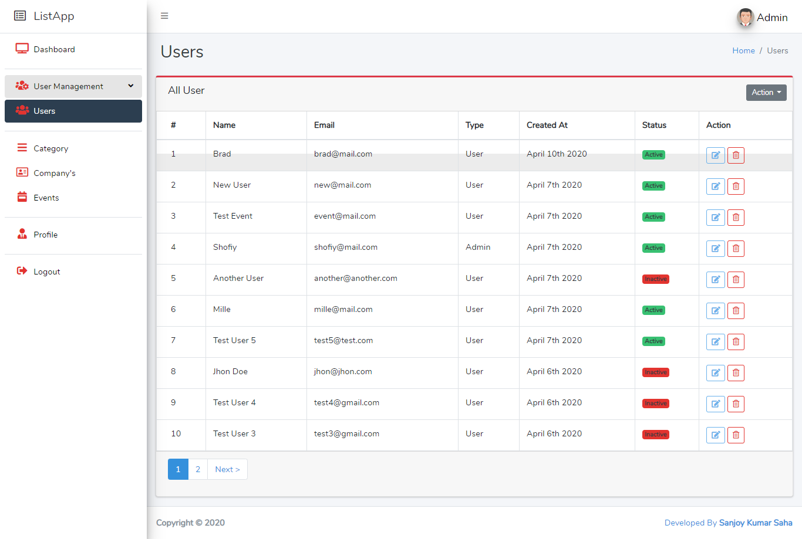

##  ListApp
This is a simple list app which is based on laravel and vue. In this application, you can do User management with roles, List management, Editing profile and Special features which has monthly events.

## Some random screenshots

## How to use

- Clone the repository with git clone.
- Copy .env.example file to .env and edit database credentials there.
- Run composer install.
- Run php artisan key:generate.
- Run php artisan migrate.
- Run php artisan serve.
- That's it: launch the main URL.
- You can login to adminpanel with default credentials email: admin@admin.com, password: password.

## License

Feel free to use as many times as you want.